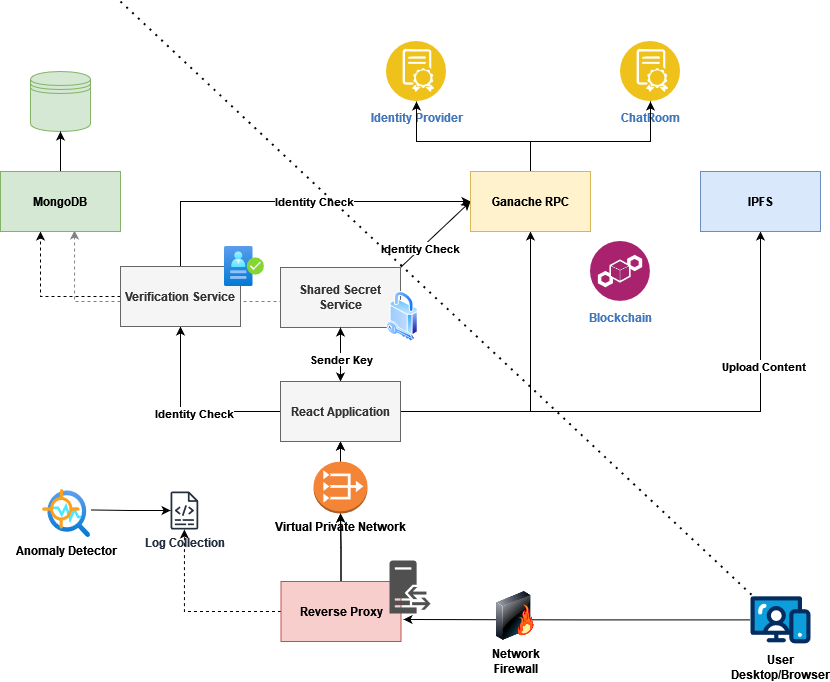

<h1 align="center">
  <br>
  
  <br>  
  SSI 2024<br/>Sencha Bloom
  <br>
</h1>

<h4 align="center">Chat Room Management contract written in <a href="https://docs.soliditylang.org/en/v0.8.4/" target="_blank">Solidity</a>.</h4>

This project implements a decentralized chatroom system with a hybrid architecture combining blockchain (for security and transparency) and centralized services (for enhanced performance and user experience). Users can join topic-based rooms, interact securely, and utilize blockchain-backed functionalities for privacy and access control.

---

## **Features**
- **Decentralized and Centralized Hybrid Design**: Combines blockchain for secure, immutable records and centralized components for speed and convenience.
- **Room-based Chat System**: Topic-focused chatrooms implemented as smart contracts, with access control based on verified identities.
- **Blockchain-backed Identity Verification**: Integration of ERC-725/735 to verify user identities and manage claims.
- **Privacy and Confidentiality**: Messages can be encrypted prior to upload on IPFS for private rooms.
- **Per-group Encryption Keys**: Managed by a centralized secrets service as a replacement for GKA/Sender Key.
- **Secure HTTPS Communication**: Managed via a Python-based CA that generates certificates for all services.

---

## **Architecture Overview**
1. **Ganache**: Local Ethereum blockchain for smart contract execution and identity management.
2. **Truffle**: Smart contract compiler and deployment tool.
3. **React Frontend**: User interface for chatroom interactions.
4. **MongoDB**: Database for storing verification and secret-related metadata.
5. **IPFS**: Decentralized file storage for chatroom messages.
6. **Secrets-Service**: Centralized service to generate per-group encryption keys.
7. **Verification-Service**: Mocks the existence of a third-party system to verify users and store verified identities on the blockchain.
8. **Nginx**: Reverse proxy for secure HTTPS communication.



---

## **Setup Instructions**

### **Prerequisites**
- Docker and Docker Compose installed on your machine.

### **Steps to Run**
1. **Clone the Repository**:
   ```bash
   git clone <repository_url>
   cd <repository_directory>
   ```

2. **Start the Docker Containers**:
   ```bash
   docker-compose up --build
   ```

3. **Access the System**:  
   All services are accessible via HTTPS through the Nginx reverse proxy. Certificates for secure communication are generated by the Python-based CA.


**You should install the Root CA to access the systems!**

---

## **Key Components**

### **Blockchain**
- **Ganache**: Provides a local Ethereum blockchain environment for smart contract deployment and testing.

### **Smart Contracts**
- **Chatroom Contracts**: Each room is a smart contract that governs membership and manages access controls.
- **ERC-725/735**: Used for identity verification and claim management.  
  *Disclaimer*: The implementation of these standards is experimental and **not production-ready**.

### **Secrets-Service**
- Acts as a central server to generate and manage per-group encryption keys, replacing traditional GKA/Sender Key mechanisms.

### **Verification-Service**
- Simulates a third-party identity verification system. Stores verified identities as claims on the blockchain using ERC-725/735 standards.

### **IPFS**
- Messages from chatrooms are uploaded to IPFS. For private rooms, messages can be encrypted before upload for added confidentiality.

### **Python CA**
- Manages certificate generation for all services, enabling secure HTTPS communication through Nginx.

---

## **How It Works**

1. **User Verification**:
    - Users must verify their identity via the Verification-Service. This can involve a mock process to simulate a real-world verification system.
    - Verified identities are stored as claims on the blockchain using ERC-725/735.

2. **Room Access**:
    - Only verified users can join chatrooms.
    - Chatroom contracts enforce membership and manage permissions.

3. **Message Handling**:
    - Messages are uploaded to IPFS.
    - For private rooms, messages are encrypted using a per-room key generated by the Secrets-Service.

---

## **Docker Services**

| **Service Name**       | **Purpose**                       | **Port** |
|------------------------|-----------------------------------|----------|
| `ganache`              | Local Ethereum blockchain         | Internal |
| `truffle`              | Smart contract deployment         | Internal |
| `react-app`            | Frontend application              | Internal |
| `mongo`                | Database for metadata storage     | Internal |
| `ipfs-node`            | Decentralized file storage        | Internal |
| `secrets-service`      | Provides encrypted room secrets   | Internal |
| `verification-service` | Verifies user claims              | Internal |
| `nginx-proxy`          | Secure reverse proxy for services | 443      |

---

## **Disclaimer**
The implementation of ERC-725/735 standards is **not production-ready** and should only be used for educational or experimental purposes.

---

### **Threat Modeling with PyTM**
To ensure the security and robustness of the chatroom architecture, we conducted a detailed threat modeling process using **PyTM**. This helped us identify potential attack vectors and vulnerabilities within our hybrid system. The model accounted for critical components like the blockchain, secrets-service, IPFS, and Nginx reverse proxy, highlighting risks such as unauthorized access to private rooms, misuse of cryptographic keys, and denial-of-service attacks on centralized components. Mitigations were proposed for each identified threat, focusing on implementing stricter access controls, monitoring, and secure key management practices.

### **Anomaly Detection with Isolation Forest**
To enhance the system’s resilience, we implemented an anomaly detection mechanism using **Isolation Forest** to analyze Nginx logs. This machine learning-based approach helps identify unusual patterns, such as repeated unauthorized access attempts or irregular traffic spikes that could indicate potential attacks. By preprocessing logs and extracting relevant features like request frequency, user-agent patterns, and source IPs, the Isolation Forest model can flag anomalies in near real-time, which can enable proactive response to potential threats.
However, it must be noted that currently the system is used offline-only.
---

## **Future Improvements**
- Add decentralized governance for room creation and management.
- Automate identity verification through integration with real-world verification systems.
- Extend support for multi-chain environments (e.g., Polygon, Binance Smart Chain).

---
